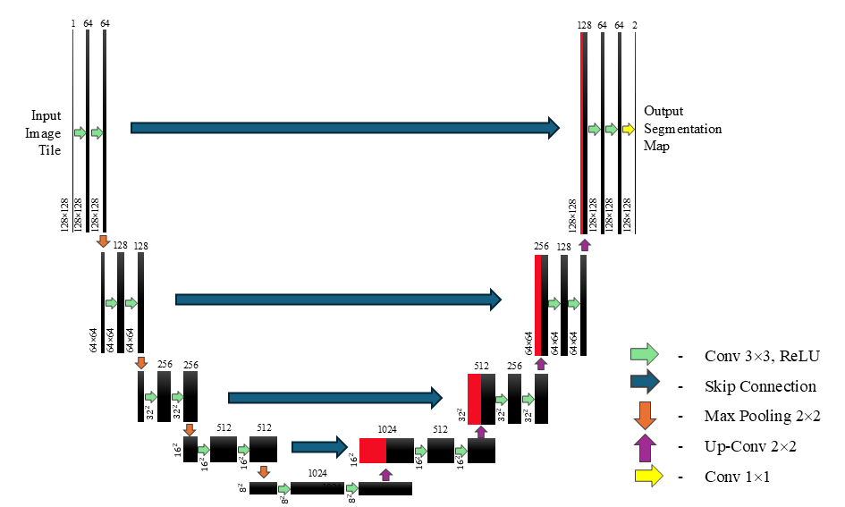

# UnetBrainMS
This repository includes the code for running the model and the various scripts used for augmentation of data including restricting lesion size in the ground truth, scripts for the purposes of rotating the brain volumes and a utilities file containing various functions for running the model and a selection of metrics. In the example produced below, the image on the LHS is an example image slice, centre is the ground truth and on RHS is the segmentation. 

# Purpose of Repository 
This repository provides documentation and code for using a U-Net model to segment multiple sclerosis (MS) lesions from brain MRI scans [1]. The architecture of the neural network is illustrated below.

In addition, scripts are included pertaining to the associated paper to perform the augmentations used in the study. These include scripts through which lesion volume size can be restricted by used of thresholds. This script only needs to operate on the labels data.

Another script is included to flip or rotate the data, the relevant script is used on both the imaging data and their respective delineations

# Repository Download and Packages

# The Data
  

The data used for the study was the MICCAI 2016 dataset which can be found on the Shanoir platform [2]. Due to the licensing agreement the data is not uploaded here, however it can be accessed freely through requesting an account on the following website: https://shanoir.irisa.fr/shanoir-ng/account-request. The dataset contains  T1, T2, FLAIR, gadolinium-enhanced and proton density imaging modalities for each of the 53 images contained within the dataset. 

# Metrics

The Dice results for both the training process and testing process are illustrate as an example over 2,000 epochs. Other metrics included are the true positive rate, false postive rate, true negative rate and false negative rate can all be plotted. 

## References

[1] Ronneberger O, Fischer P, Brox T. U-net: Convolutional networks for biomedical image segmentation. InInternational Conference on Medical image computing and computer-assisted intervention 2015 Oct 5 (pp. 234-241). Cham: Springer international publishing. DOI: https://doi.org/10.48550/arXiv.1505.04597

[2] Commowick O, Kain M, Casey R, Ameli R, Ferré JC, Kerbrat A, Tourdias T, Cervenansky F, Camarasu-Pop S, Glatard T, Vukusic S. Multiple sclerosis lesions segmentation from multiple experts: The MICCAI 2016 challenge dataset. Neuroimage. 2021 Dec 1;244:118589. DOI: https://doi.org/10.1016/j.neuroimage.2021.118589
